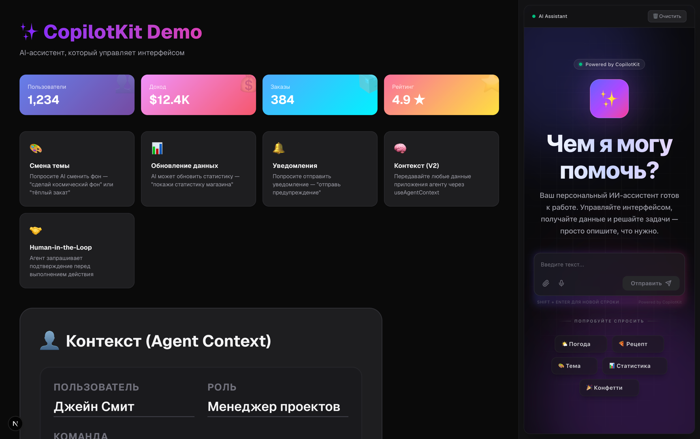
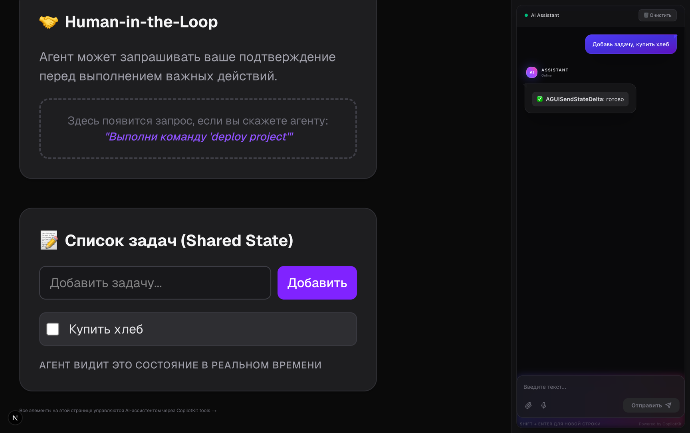
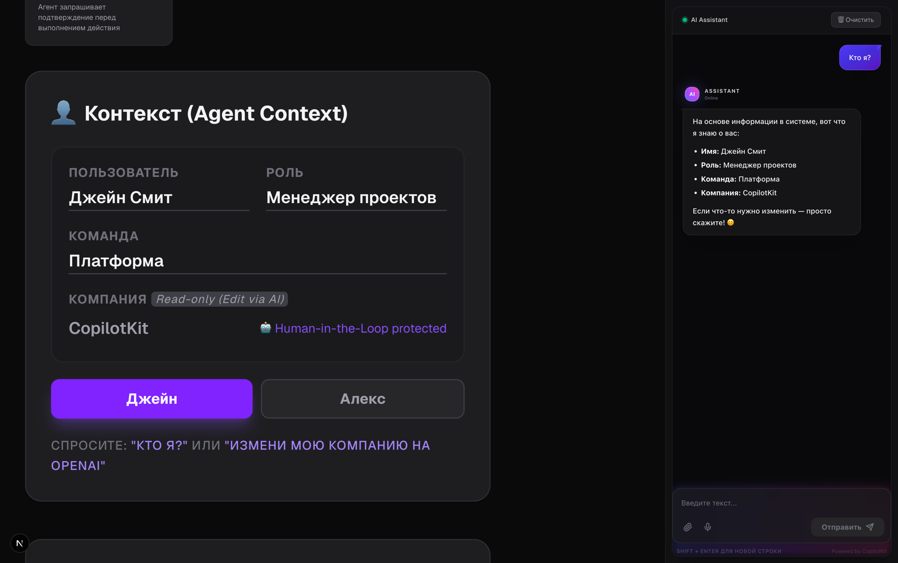
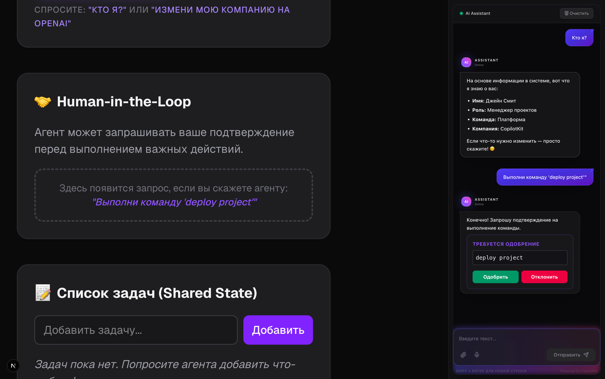

# CopilotKit Demo Project

Это демонстрационный проект, созданный для ознакомления с возможностями **CopilotKit** — мощного фреймворка для
интеграции AI-ассистентов в React-приложения.

Проект демонстрирует использование Generative UI, кастомных инструментов (Frontend Tools) и глубокую интеграцию
ассистента с интерфейсом приложения.

---

## 🚀 Основные возможности

В этом демо реализован AI-ассистент, который не просто общается текстом, но и активно взаимодействует с UI:

- **🌤 Умная погода** — Отображение интерактивных карточек погоды.
- **🍳 Рецепты на лету** — Генерация и визуализация кулинарных рецептов с ингредиентами и шагами.
- **🎨 Управление темой** — Возможность попросить AI сменить фон или цветовую схему страницы.
- **📊 Динамический дашборд** — Обновление метрик и статистики через текстовые команды.
- **🔔 Системные уведомления** — Отправка реальных уведомлений на интерфейс.
- **🎉 Интерактив** — Запуск анимации конфетти для празднования успехов.

---

## 📸 Скриншоты приложения

### Общий вид (Preview)

Демонстрация основного интерфейса чата и его интеграции в приложение.


### Состояние агента (Agent State)

Визуализация того, как агент управляет состоянием и выполняет действия.


### Использование контекста (Use Agent Context)

Пример того, как AI использует контекст приложения для принятия решений.


### Человек в цикле (Human-in-the-loop)

Демонстрация механизмов подтверждения действий пользователя.


---

## 🛠 Технологический стек

- **Framework:** [Next.js 16](https://nextjs.org/)
- **AI Core:** [CopilotKit](https://www.copilotkit.ai/)
- **Styling:** Tailwind CSS

---

## ⚙️ Переменные окружения

Для работы проекта необходимо настроить следующие переменные окружения в файле `.env.local`:

- `OPENAI_API_KEY` — Ваш API-ключ для доступа к языковым моделям. В данном демо проект настроен на работу
  с [OpenRouter](https://openrouter.ai/).
- `OPENAI_BASE_URL` — Базовый URL для запросов к API. По умолчанию используется `https://openrouter.ai/api/v1`.

---

## 🏁 Быстрый старт

1. **Установите зависимости:**
   ```bash
   npm install
   ```

2. **Настройте переменные окружения:**
   Создайте файл `.env.local` на основе `.env` и добавьте туда ваш API ключ.

3. **Запустите проект:**
   ```bash
   npm run dev
   ```

Откройте [http://localhost:3000](http://localhost:3000) в браузере.
